# Authentication Flow Documentation
This document outlines the complete authentication flow for email verification and auto-login using a unified token system.

## Overview
The system uses a **two-scope token system** for secure email verification and auto-login:
- **`verify` scope**: Email verification tokens (24h expiry)
- **`authN` scope**: One-time authentication tokens for auto-login (5min expiry)

## Registration Flow
1. **User Registration**: User submits registration form with `name`, `email`, and `password`
2. **Database Entry**: New user created with `emailVerified: null` and `role: null`
3. **Verification Token**: System creates a `verify` scope token (hex format, 64 chars, 24h expiry)
4. **Email Delivery**: Verification link sent to user's email address

### Process Flow Diagram

```mermaid
sequenceDiagram
    actor User
    participant SignUp as /agency/sign-up
    participant RegAPI as POST /api/auth/register
    participant DB as Database
    participant Email as Email Service
    participant ConfirmAPI as GET /api/auth/register/confirm
    participant VerifyPage as /agency/verify
    participant AuthAPI as POST /api/auth/callback/credentials
    participant JWT as JWT Callback
    participant Session as Session Callback
    participant Middleware as Middleware (proxy.ts)
    participant AgencyPage as /agency

    User->>SignUp: 1. Fill registration form
    SignUp->>RegAPI: 2. POST {name, email, password}
    RegAPI->>DB: 3. Create user (emailVerified: null, role: null)
    RegAPI->>DB: 4. createVerificationToken(email, 'verify', 24h)
    Note right of DB: Token: { identifier: 'verify:email', token: hex64, expires }
    RegAPI->>Email: 5. Send email with /confirm?token=hex64
    RegAPI->>SignUp: 6. Return 201 Created
    SignUp->>VerifyPage: 7. Redirect to /agency/verify?email=xxx
    
    Note over User,Email: User checks email and clicks verification link
    
    User->>ConfirmAPI: 8. Click link: /confirm?token=hex64
    ConfirmAPI->>ConfirmAPI: 9. validateVerificationToken(token)
    Note right of ConfirmAPI: Scope: 'verify'
    alt Token Valid & Scope='verify'
        ConfirmAPI->>DB: 10. Update: emailVerified=NOW(), role=AGENCY_OWNER
        ConfirmAPI->>DB: 11. Delete verify token
        ConfirmAPI->>DB: 12. createVerificationToken(email, 'authN', 5min)
        Note right of DB: Token: { identifier: 'authN:email', token: hex64, expires }
        ConfirmAPI->>VerifyPage: 13. 307 → /verify?verified=true&email=xxx&token=authN_hex64
        
        VerifyPage->>VerifyPage: 14. Detect verified & authN token
        VerifyPage->>AuthAPI: 15. signIn('credentials', {email, password: authN_hex64})
        AuthAPI->>AuthAPI: 16. Pattern check: /^[a-f0-9]{64}$/ = true → isAutoLogin
        AuthAPI->>AuthAPI: 17. validateVerificationToken(authN_hex64)
        Note right of AuthAPI: Scope: 'authN' → return email only
        AuthAPI->>DB: 18. Verify email matches user
        AuthAPI->>DB: 19. deleteVerificationToken(authN_hex64)
        AuthAPI->>JWT: 20. Trigger JWT callback
        JWT->>DB: 21. Fetch user (emailVerified, role, agencyId)
        JWT->>JWT: 22. token.emailVerified = dbUser.emailVerified
        JWT->>Session: 23. Return JWT
        Session->>Session: 24. session.user.emailVerified = token.emailVerified
        Session->>AuthAPI: 25. Return session
        AuthAPI->>VerifyPage: 26. Sign-in success
        
        VerifyPage->>AgencyPage: 27. window.location.href = '/agency'
        AgencyPage->>Middleware: 28. Request /agency
        Middleware->>Middleware: 29. req.auth.user.emailVerified exists?
        Middleware->>AgencyPage: 30. ✅ Allow access
        AgencyPage->>User: 31. Show dashboard
    else Token Invalid/Expired
        ConfirmAPI->>VerifyPage: 10. → /verify?error=invalid-token&email=xxx
        VerifyPage->>User: 11. Show error with resend option
    end
```

Token Validation Flow

### validateVerificationToken(token)
This unified function handles both verification scopes:

**For `verify` scope tokens:**
1. Validates token exists and hasn't expired
2. Updates user: `emailVerified = NOW()`, `role = AGENCY_OWNER`
3. Deletes the verify token
4. Creates new `authN` token (5min expiry)
5. Returns: `{success: true, url: '/verify?verified=true&email=xxx&token=authN_hex', email, scope: 'verify', user}`

**For `authN` scope tokens:**
1. Validates token exists and hasn't expired
2. Returns email only (no DB updates)
3. Returns: `{success: true, email, scope: 'authN'}`

**On Error:**
Returns: `{success: false, error: 'expired-token' | 'invalid-token', email?, message}`
3. **Successful Verification**: Upon successful veri& create authN token | `token` (hex 64 chars) | `307` redirect with authN token |
| `/api/auth/register/verify` | GET | Check resend cooldown status | `email` | `200` `{cooldownActive, remainingSeconds}` |
| `/api/auth/register/verify` | POST | Resend verification email | `{email}` | `200` or `429` if in cooldown (5min)
### Registration Routes
| Route | Method | Purpose | Parameters | Response |
|-------|--------|---------|------------|----------|
| `/agency/sign-up` | GET | Display registration form | - | HTML page |
| `/api/auth/register` | POST | Create user & send verification email | `{name, email, password}` | `201` with redirect to verify page |

### Email Verification Routes
| Route | Method | Purpose | Parameters | Response |
|-------|--------|---------|------------|----------|
| `/api/auth/register/confirm` | GET | Verify email token & create OTT | `token` (verification token) | `307` redirect to `/agency/verify?verified=true&email=xxx&token=OTT` |
| `/api/auth/register/verify` | GET | Check verification cooldown | `email` | `200` with cooldown status |
| `/api/auth/register/verify` | POST | Resend verification email | `{email}` | `200` or `429` if in cooldown |
| `/api/auth/register/status` | GET | Check verification status | `email` | `200` with verification status |

### Authentication Routes
| Route | Method | Purpose | Parameters | Response |
|-------|--------|---------|------------|----------|
| `/api/auth/callback/credentials` | POST | NextAuth credentials login | `{email, password}` or `{email, password: OTT}` | `200` with session cookie |
| `/api/auth/session` | GET | Get current session | - | `200` with session data |
| `/api/auth/csrf` | GET | Get CSRF token | - | `200` with CSRF token |
| `/api/auth/signout` | POST | Sign out user | - | `200` |

### Pages
| Page | Auth Required | Purpose | Query Params |
|------|---------------|---------|--------------|
| `/agency/sign-up` | No | User registration form | - |
| `/agency/sign-in` | No | User login form | `redirect`, `callbackUrl`, `verified`, `email`, `error` |
| `/agency/verify` | No | Email verification scallbackUrl`, `error` |
| `/agency/verify` | No | Email verification status & auto-login | `email`, `verified` (true/false), `token` (authN hex64

## Token System

All tokens use the unified `createVerificationToken(email, scope, milliseconds)` function.

### Token Format
```typescript
{
  identifier: `${scope}:${email}`,  // e.g., "verify:user@example.com"
  token: randomBytes(32).toString('hex'),  // 64 hex characters
  expires: new Date(Date.now() + milliseconds)
}
```

### Token Scopes

| Scope | Identifier Format | Expiry | Purpose | Deleted After |
|-------|------------------|--------|---------|---------------|
| `verify` | `verify:{email}` | 24 hours | Email verification link | Email confirmed |
| `authN` | `authN:{email}` | 5 minutes | Auto-login after verification | Sign-in completed |

### Session Token (JWT)
- **Purpose**: Maintain authenticated session
- **Storage**: HTTP-only secure cookie (`authjs.session-token`)
- **Expiration**: NextAuth default (30 days)
- **Format**: Encrypted JWT
- *Core Functions

### createVerificationToken(email, scope, milliseconds)
**Location**: `src/lib/queries.ts`

Creates a new verification token with automatic cleanup of old tokens:
```typescript
// Auto-deletes existing tokens with same identifier before creating new one
await db.verificationToken.deleteMany({ 
  where: { identifier: `${scope}:${email}` } 
})

return db.verificationToken.create({
  data: {
    identifier: `${scope}:${email}`,
    token: randomBytes(32).toString('hex'),  // 64 hex chars
    expires: new Date(Date.now() + milliseconds)
  }
})
```

### validateVerificationToken(token)
**Location**: `src/lib/queries.ts`

Unified validation for both token scopes:
```typescript
const verificationToken = await db.verificationToken.findUnique({ 
  where: { token } 
})

// Extract scope from identifier: 'verify:email' → 'verify'
const [scope, email] = verificationToken.identifier.split(':')

if (scope === 'verify') {
  // Update user, delete token, create authN token
  // Return: {success, url, email, scope, user}
} else if (scope === 'authN') {
  // Just return email for auto-login
  // Return: {success, email, scope}
}
```

## Session Management

### JWT Callback (`src/auth.ts`)
```typescript
async jwt({ token, user }) {
  const userId = user?.id || token.id
  const dbUser = await db.user.findUnique({ where: { id: userId } })
  Auto-Login Implementation

The verify page automatically signs in the user using the authN token:

```typescript
// src/app/(main)/agency/(auth)/verify/page.tsx
useEffect(() => {
  if (verified === 'true' && autoLoginToken && email) {
    // Sign out old session first
    if (session) {
      await fetch('/api/auth/signout', { method: 'POST' })
    }
    
    // Sign in using authN token as password
    const result = await signIn('credentials', {
      email,
      password: autoLoginToken,  // ← authN hex token (64 chars)
      redirect: false
    })
    
    if (result?.ok) {
      window.location.href = '/agency'  // Force full reload
    }
  }
}, [verified, autoLoginToken, email, session])
```

### How authN Token Works as Password

**Credentials Provider Detection** (`src/auth.ts`):
```typescript
async authorize(credentials) {
  const user = await db.user.findUnique({ where: { email } })
  
  // Detect authN token by hex pattern (64 chars)
  const isAutoLogin = /^[a-f0-9]{64}$/i.test(credentials.password)
  
  if (isAutoLogin) {
    // Validate authN token
    const result = await validateVerificationToken(credentials.password)
    if (result.email !== user.email) throw Error
    
    // Delete one-time token
    await deleteVerificationToken(credentials.password)
    
    return user  // ✅ Sign in successful
  } else {
    // Regular password flow
    const valid = await bcrypt.compare(credentials.password, user.password)
    if (!valid) throw Error
    
    return user  // ✅ Sign in successful
  }
}
```

The Credentials provider doesn't care what's in the password field - it just passes it to `authorize()`. We use pattern matching to differentiate between real passwords and authN tokens.

## Key Design Decisions

1. **Unified Token System**: Both verification and auto-login use the same token table and validation logic, just with different scopes
2. **Hex Format**: All tokens use `randomBytes(32).toString('hex')` (64 chars) for consistency
3. **Auto-Cleanup**: `createVerificationToken` automatically deletes old tokens before creating new ones
4. **One-Time Use**: All tokens are deleted immediately after successful validation
5. **Pattern Detection**: authN tokens detected by hex pattern (`/^[a-f0-9]{64}$/`) in credentials flow
6. **Single Auth Instance**: Middleware imports from `src/auth.ts` to ensure callbacks run properly

## Security Considerations

- ✅ All tokens are cryptographically random (32 bytes)
- ✅ Tokens stored in database, not URL-encoded or client-side
- ✅ One-time use - deleted after consumption
- ✅ Short expiry for authN tokens (5 minutes)
- ✅ Email verification required before agency access
- ✅ OAuth users automatically verified
- ✅ Cooldown on verification email resends (5 minutes)
}
```

### Middleware Protection (`src/proxy.ts`)
```typescript
import { auth } from './auth'  // ← MUST use same instance

export default auth((req) => {
  const user = req.auth?.user
  
  // Check verification before allowing /agency/* access
  if (user && user.email && !user.emailVerified) {
    return NextResponse.redirect(`/agency/verify?email=${user.email}`)
  }
})
```

**⚠️ Critical**: Middleware must import `auth` from `src/auth.ts`, not create a new NextAuth instance, otherwise callbacks won't run.
}
```

## Known Issues & Debugging

### Issue: emailVerified undefined in middleware despite database update
**Symptoms**: 
- JWT callback logs show `emailVerified: 2026-01-01T10:35:33.317Z`
- Middleware logs show `emailVerified: undefined`
- Infinite redirect loop between `/agency` and `/agency/verify`

**Root Cause**: Session callback not copying `token.emailVerified` to `session.user.emailVerified`

**Solution**: Ensure session callback includes:
```typescript
session.user.emailVerified = token.emailVerified as Date | null
```

### Debug Logging
Enable these logs to trace the flow:
1. **Confirm endpoint**: `console.log('🔄 Redirecting to:', redirectUrl)`
2. **JWT callback**: `console.log('✅ JWT token updated with emailVerified:', token.emailVerified)`
3. **Session callback**: `console.log('✅ Session user.emailVerified set to:', session.user.emailVerified)`
4. **Middleware**: `console.log('🔍 Middleware verification check:', { emailVerified: user?.emailVerified })`